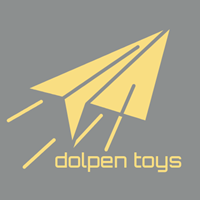

# Toys (for Fabric)

主に個人向けのクライアント向け追加機能を実装しています

## 導入

[GitHub release](https://github.com/dolpen/toys-fabric/releases) から成果物がDLできます

## 開発

### 前提

- OpenJDK 21 ([Eclipse Temurin](https://adoptium.net/) がおすすめです)
- Gradle > 8.8.x (付属のラッパーを使うのが楽です)
- その他依存ライブラリについてはすべて Gradle のバージョンカタログに記載しているので、適宜調整してください

### よく使うGradleタスク

Gradle IDE 統合 (IntelliJ など) を経由して実行するのをおすすめします

* `genSources` : Minecraftの本体ソースを生成します
* `spotlessApply` : コードをフォーマットします
    * IDEなどに依存しないように Gradle プラグインを使っています
    * [google-java-format](https://github.com/google/google-java-format) を使っています
* `build` : 成果物を作ります
    * `build/libs` にアーティファクトが出力されます
